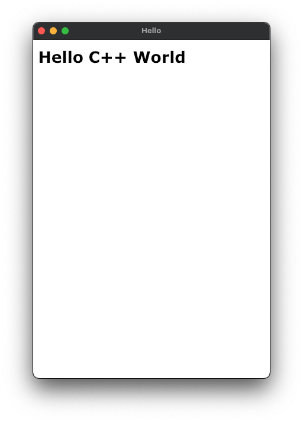

# Sciter Hello C++ Demo on Mac OS

Sciter is an embeddable HTML/CSS/scripting engine, Windows, Mac OSX and Linux. This demo project shows how to use sciter to build Mac OS applications on the command line.

## Build

```shell
make
```

## Screenshot

```shell
./hello-cpp
```


